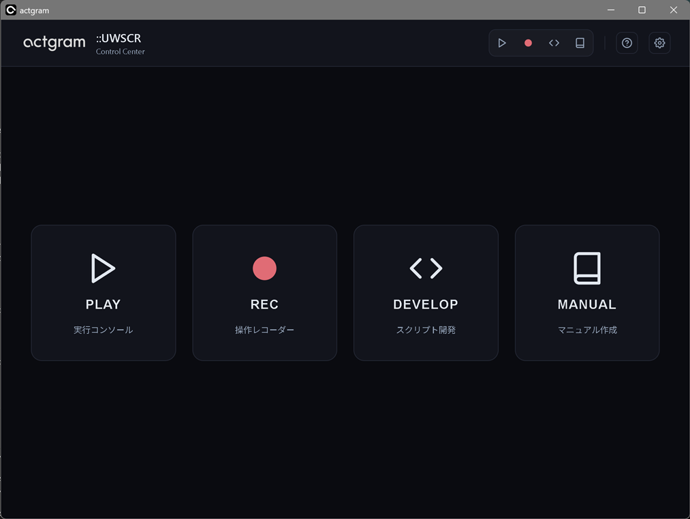
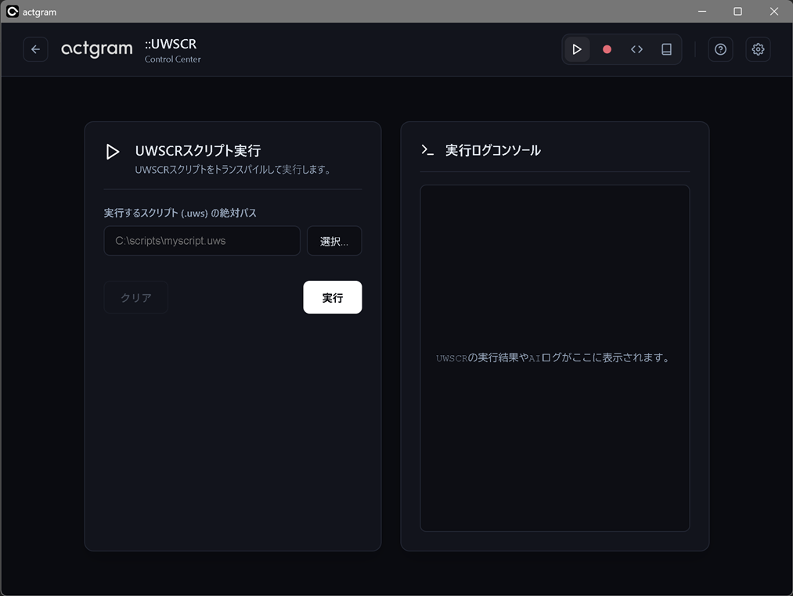
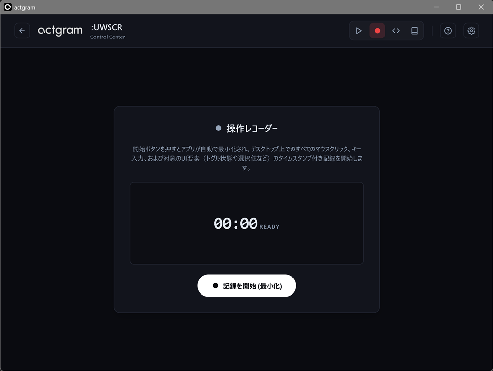
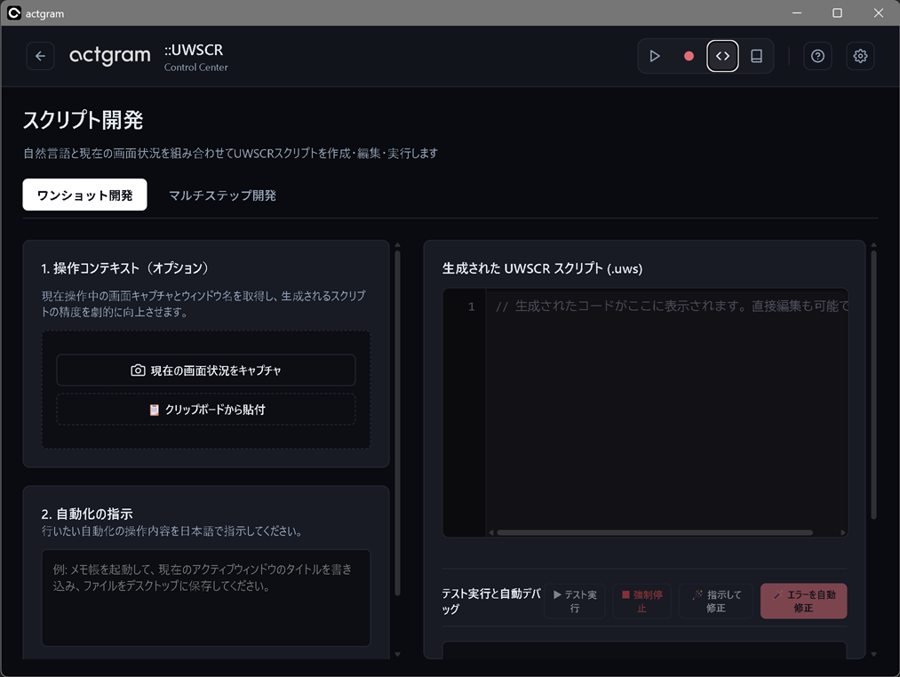
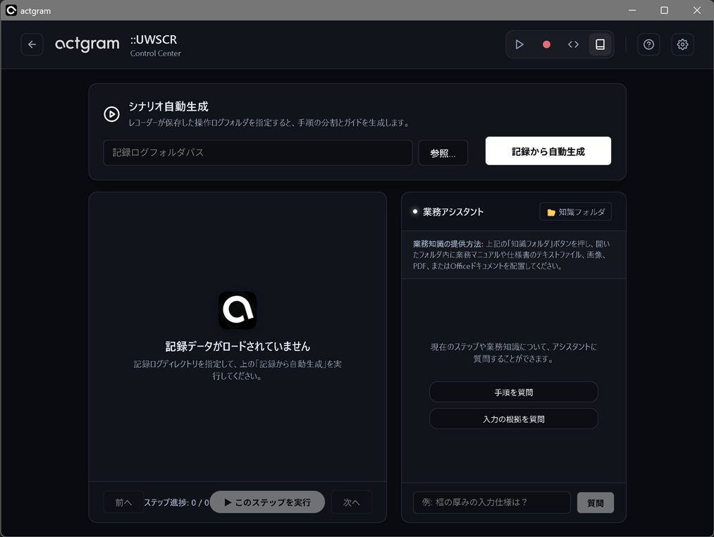
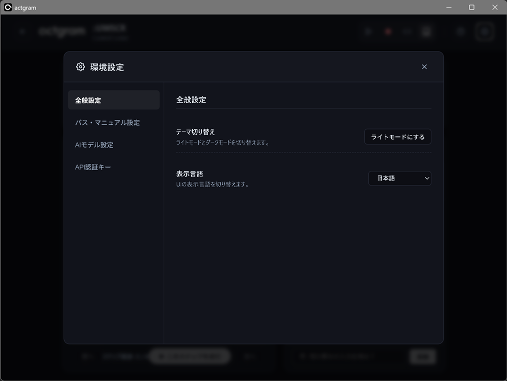

# actgram::UWSCR

**RPA Sidecar for UWSCR** — UWSCR スクリプトへの支援とスクリプト生成機能を追加する、軽量なサイドカーエージェントです。

---

## Overview

`actgram` は、[UWSCR](https://github.com/stuncloud/UWSCR) を子プロセスとして起動・管理し、LLM（大規模言語モデル）との連携機能を追加するラッパーアプリケーションです。UWSCR 本体には一切手を加えず、隣に置いて使うだけで動作します。

**技術スタック**: Go (Wails v2) + Svelte — Windows ネイティブアプリとして動作します。

---

## 🔒 ローカルLLMによる完全オフライン動作

**actgram は [Ollama](https://ollama.com/) と組み合わせることで、すべての処理をPC内で完結させることができます。**

業務の自動化スクリプト生成・画面解析などを行う際、**スクリーンショットや操作内容が外部サーバーに一切送信されません**。
社内システム・個人情報を扱う環境でも、情報漏洩のリスクなく自動支援の恩恵を受けられます。

| 動作モード | 外部通信 | API費用 | 向いている用途 |
|-----------|---------|---------|---------------|
| **Ollama（ローカル）** | **なし** | **無料** | 機密データ・社内業務・オフライン環境 |
| Gemini / Claude（クラウド） | あり | 従量課金 | 高精度が必要な処理・マルチモーダル |

> **セットアップ**: [Ollama](https://ollama.com/) をインストールし、使用したいモデル（例: `ollama pull qwen2.5-coder`）を取得するだけです。actgram が起動中のモデルを自動検出します。APIキーの登録は不要です。

---

## Screenshots

### Home
ホーム画面です。PLAY, REC, DEVELOP, MANUALを選択し、操作を進めます。



---

### スクリプト実行
`.uws` ファイルを選択して実行。stdout / stderr をリアルタイムでコンソールに表示します。



---

### 操作レコーダー
記録を開始し、自動化したい操作を行います。記録を停止するとそれまでに実行した操作が分析されます。



---

### スクリプト開発（ジェネレータ）
画面キャプチャとアクティブウィンドウ名をコンテキストとして付与し、自動化の指示から UWSCR スクリプトを生成します。生成されたコードはその場で編集・保存・テスト実行が可能です。



---

### マニュアル作成
操作手順をステップごとに入力すると、スクリーンショット・音声ガイド（Gemini TTS）付きの HTML マニュアルと、手順を自動実行する `.uws` スクリプトをまとめてパッケージ生成します。



---

### 環境設定
`uwscr.exe` のパス指定、LLM プロバイダーごとの API キー登録（Windows 資格情報マネージャー経由）、各レイヤーへのモデル割り当てを行います。



---

## Features

### スクリプト自動生成 (Script Developer)
画面キャプチャとプロンプトから UWSCR スクリプトを自動生成します。アクティブウィンドウのタイトルを自動取得してコンテキストとして付与するため、画面の状況に即したコードが得られます。エラー発生時はログを渡して自動修正を試みます。

### `AI_EVAL()` マクロ拡張
`.uws` スクリプト内に独自関数 `AI_EVAL("判定内容", GetScreenCapture())` を記述できます。実行前にトランスパイラがこの構文を標準の UWSCR コードに変換し、実行時にローカルAPIサーバー経由で問い合わせます。

```uwscr
// 例: 画面を見せて判定させる
Dim result = AI_EVAL("ログインが完了しているか確認してください", GetScreenCapture())
IFB result = "はい" THEN
    // 次の処理へ
ENDIF
```

### マルチLLMルーター
Gemini、Claude、**Ollama（ローカル）** の3プロバイダーに対応。役割ごとに使うモデルを GUI から割り当てられます。

Ollama を選択した場合、**すべての推論がローカルPC上で完結**し、外部への通信は発生しません。

| レイヤー | 役割 |
|---------|------|
| **Brain** | スクリプト生成・エラー修正・判定処理 |
| **Eye** | 視覚情報の解析（将来拡張用） |
| **Utility** | 軽量タスク（将来拡張用） |

モデル一覧はAPIキー設定後にリアルタイム取得します（Gemini / Anthropic）。Ollama はローカルで起動中のモデルを自動検出します。

### セキュアなAPIキー管理
APIキーは設定ファイルに書きません。Windows 資格情報マネージャー（Credential Manager）に保存するため、`config.yaml` を誤ってコミットしてもキーは漏れません。

### スクリプト実行・停止
トランスパイル済みスクリプトを UWSCR 経由で実行し、stdout/stderr をリアルタイムでコンソールに表示します。実行中のプロセスはワンクリックで強制終了できます。

### インタラクティブマニュアル生成
操作手順をステップごとに入力すると、スクリーンショット・音声ガイド（Gemini TTS）付きの HTML マニュアルと、手順を自動実行する `.uws` スクリプトを生成します。

---

## Design

**サイドカー設計**: UWSCR 本体とは子プロセス + 標準入出力で疎結合に連携します。UWSCR の内部には干渉しません。

**依存最小化**: LLM との通信は `net/http` + `encoding/json` による直叩きHTTPクライアントで実装。外部依存ライブラリを増やしません。

**UIスレッド保護**: UWSCR の実行・ローカルAPIサーバーの待受など、ブロッキングI/O はすべて Goroutine で非同期処理します。

**ポータブル**: ZIPを展開して `uwscr.exe` と同じフォルダに置くだけで動作します。環境変数PATHの変更は不要です。

---

## Requirements

- Windows 10 / 11
- [UWSCR](https://github.com/stuncloud/UWSCR/releases) (`uwscr.exe` を `actgram.exe` と同じフォルダに配置)

---

## Build from Source

```bash
# 必要なツール: Go 1.22+, Node.js LTS, Wails CLI

# 開発サーバー起動 (ホットリロードあり)
wails dev

# プロダクションビルド → build/bin/actgram.exe
wails build
```

---

## Acknowledgement

本プロジェクトは、**[stuncloud 氏](https://github.com/stuncloud)** が開発・公開されている **[UWSCR](https://github.com/stuncloud/UWSCR)** なしには成立しません。

UWSC の精神を引き継ぎ、Rust でゼロから構築された高機能なスクリプトエンジンを開発・公開してくださっていることに、深く感謝します。

---

## License

MIT
