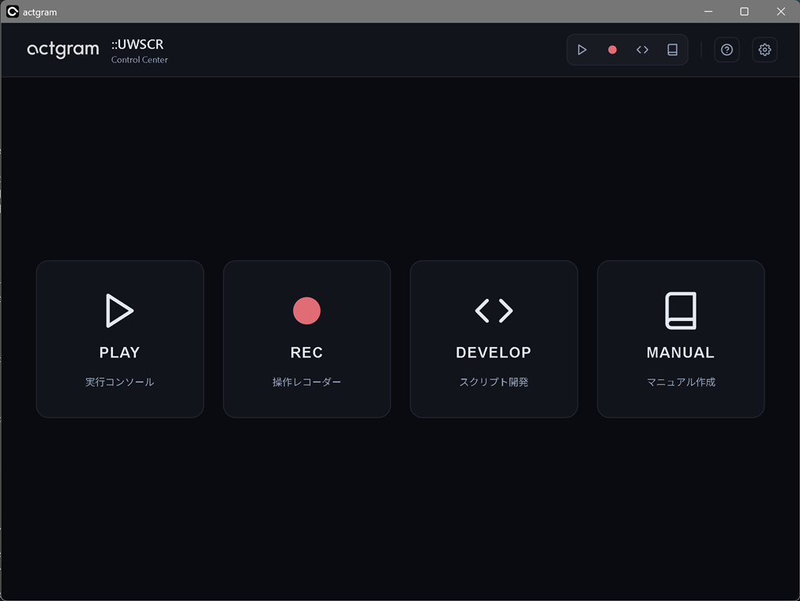
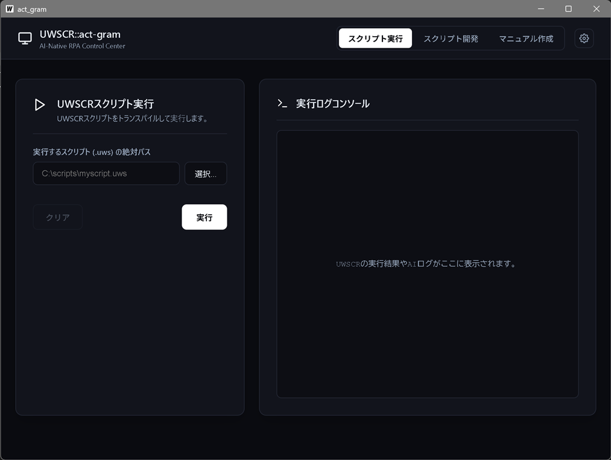
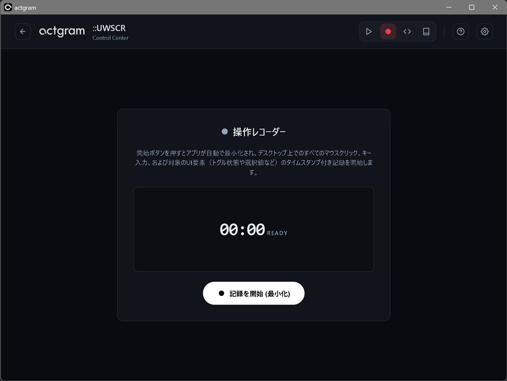
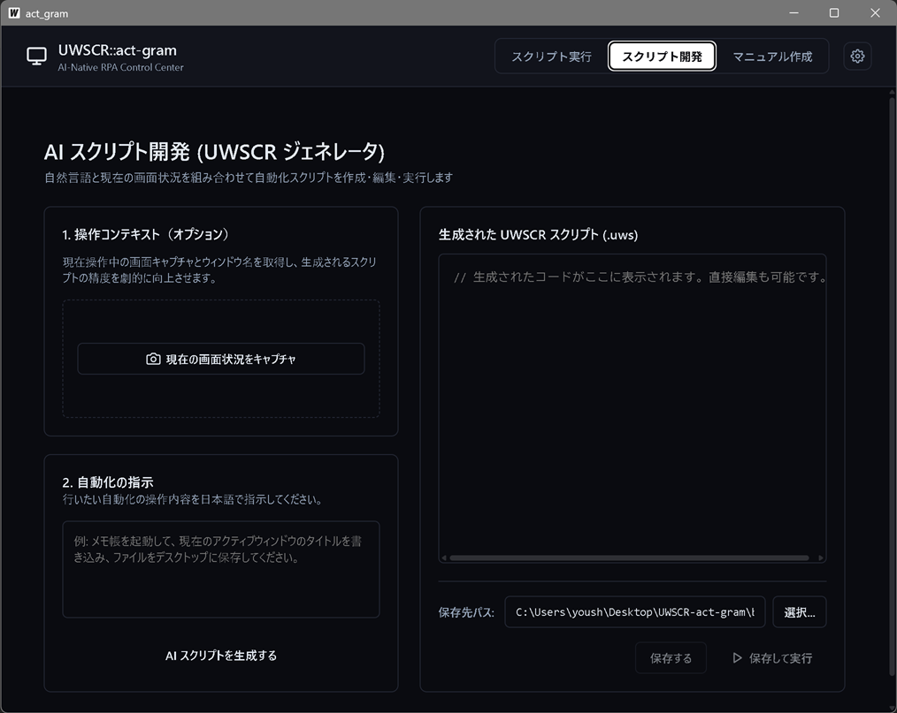
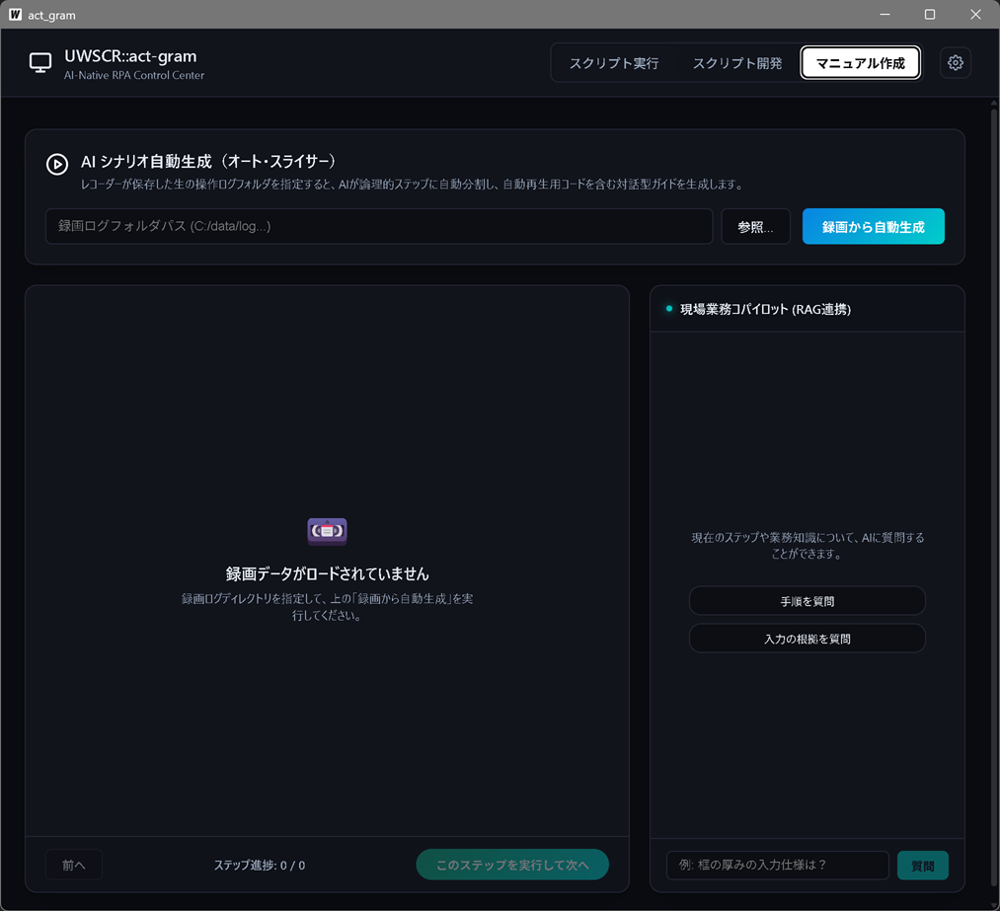
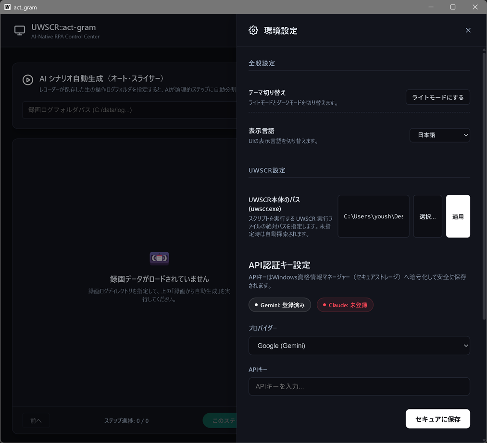

# actgram::UWSCR

**RPA Sidecar for UWSCR** — UWSCR スクリプトへの支援とスクリプト生成機能を追加する、軽量なサイドカーエージェントです。

---

## Overview

`actgram` は、[UWSCR](https://github.com/stuncloud/UWSCR) を子プロセスとして起動・管理し、LLM（大規模言語モデル）との連携機能を追加するラッパーアプリケーションです。UWSCR 本体には一切手を加えず、隣に置いて使うだけで動作します。

**技術スタック**: Go (Wails v2) + Svelte — Windows ネイティブアプリとして動作します。

---

## 🔒 ローカルLLMによる完全オフライン動作

**actgram は [Ollama](https://ollama.com/) と組み合わせることで、すべての処理をPC内で完結させることができます。**

業務の自動化スクリプト生成・画面解析などを行う際、**スクリーンショットや操作内容が外部サーバーに一切送信されません**。
社内システム・個人情報を扱う環境でも、情報漏洩のリスクなく自動支援の恩恵を受けられます。

| 動作モード | 外部通信 | API費用 | 向いている用途 |
|-----------|---------|---------|---------------|
| **Ollama（ローカル）** | **なし** | **無料** | 機密データ・社内業務・オフライン環境 |
| Gemini / Claude（クラウド） | あり | 従量課金 | 高精度が必要な処理・マルチモーダル |

> **セットアップ**: [Ollama](https://ollama.com/) をインストールし、使用したいモデル（例: `ollama pull qwen2.5-coder`）を取得するだけです。actgram が起動中のモデルを自動検出します。APIキーの登録は不要です。

---

## Screenshots

### Home
ホーム画面です。PLAY, REC, DEVELOP, MANUALを選択し、操作を進めます。



---

### スクリプト実行
`.uws` ファイルを選択して実行。stdout / stderr をリアルタイムでコンソールに表示します。



---

### 操作レコーダー（超高速・安定化）
記録を開始し、自動化したい操作を行います。Win32 GDI API による10msオーダーのネイティブキャプチャと入力集約バッファにより、PCの遅延やフリーズなく確実な記録が可能です。記録停止後は自動的にマニュアルスタジオへデータが引き継がれます。



---

### スクリプト開発（ジェネレータ）
画面キャプチャとアクティブウィンドウ名をコンテキストとして付与し、自動化の指示から UWSCR スクリプトを生成します。生成されたコードはその場で編集・保存・テスト実行が可能です。



---

### マニュアルスタジオ（対話的編集・自動化連動）
記録された操作や手動追加した手順を、現場作業者が一目で理解できる業務マニュアルと自動制御スクリプトとして管理・編集できます。
- **直感的な3ペイン構成**: ステップ一覧、手順情報編集、プレビュー表示。
- **画像クリック連動**: 画面プレビュー上の任意位置をクリックするだけで、マーカー座標と UWSCR 自動制御コード（`btn(...)`）がリアルタイムに連動更新されます。
- **ステップの自由な並び替え・追加・削除**: 手順の追加や並び替え、ステップごとの単体テスト実行が可能。
- **シナリオの永続化**: `scenario.json` としていつでも保存・再読み込みが可能。
- **全ステップ一括実行**: 定義された全ステップを UWSCR でシミュレーション実行。
- **パッケージ出力**: HTML マニュアル、スクリーンショット、音声ガイド、UWSCR 統合スクリプトを一括出力。



---

### 環境設定
`uwscr.exe` のパス指定、LLM プロバイダーごとの API キー登録（Windows 資格情報マネージャー経由）、各レイヤーへのモデル割り当てなどの設定を行います。



---

## Features

### 超高速・堅牢な操作レコーダー (Robust Recorder)
- **Win32 ネイティブキャプチャ**: 従来の外部コマンド起動を全廃し、Win32 GDI API（`BitBlt`）による10ms台の超高速画面取り込みを実現。
- **入力スマート集約**: 連続するタイピング入力を1つの操作イベントに自動統合し、冗長なログを排除。
- **OSフック安定化**: 専用メッセージループと `LockOSThread` により、長時間の記録でもフリーズやフック解除を防止。
- **非破壊キャプチャ**: 元画像データをそのまま保持し、UI上でマーカー位置を後から何度でも調整可能。

### インタラクティブ・マニュアルスタジオ (Interactive Manual Studio)
- **業務手順の構造化**: 操作タイトル、詳細説明、対象ウィンドウ名、操作要素、アクション種別を明確に分離。
- **GUI・コードの双方向バインディング**: プレビュー画面をクリックしてマーカー位置を変更すると、対応する UWSCR 操作スクリプト（`btn` コール）が自動更新。
- **シナリオ保存・読込**: 作成途中のマニュアルや自動化手順をプロジェクトファイル（`scenario.json`）として永続化。
- **ワンクリック一括自動実行**: 全手順を結合した UWSCR スクリプトを生成し、実際の環境で自動実行シミュレーションを実施。
- **多用途エクスポート**: 社内配布用 HTML マニュアル（折りたたみ UWSCR コード付き）や、自動化用 `.uws` 単体ファイルを即座に出力。

### スクリプト自動生成 (Script Developer)
画面キャプチャとプロンプトから UWSCR スクリプトを自動生成します。アクティブウィンドウのタイトルを自動取得してコンテキストとして付与するため、画面の状況に即したコードが得られます。エラー発生時はログを渡して自動修正を試みます。

### `AI_EVAL()` マクロ拡張
`.uws` スクリプト内に独自関数 `AI_EVAL("判定内容", GetScreenCapture())` を記述できます。実行前にトランスパイラがこの構文を標準の UWSCR コードに変換し、実行時にローカルAPIサーバー経由で問い合わせます。

```uwscr
// 例: 画面を見せて判定させる
Dim result = AI_EVAL("ログインが完了しているか確認してください", GetScreenCapture())
IFB result = "はい" THEN
    // 次の処理へ
ENDIF
```

### マルチLLMルーター
Gemini、Claude、ChatGPT、**LM Studio/Ollama（ローカルLLM）** などのプロバイダーに対応。役割ごとに使うモデルを GUI から割り当てられます。

LM Studio/Ollama（ローカルLLM）を選択した場合、**すべての推論がローカルPC上で完結**し、外部への通信は発生しません。

| レイヤー | 役割 |
|---------|------|
| **Brain** | スクリプト生成・エラー修正・判定処理 |
| **Eye** | 視覚情報の解析 |
| **Utility** | 軽量タスク |

モデル一覧はAPIキー設定後にリアルタイム取得します。LM Studio/Ollama（ローカルLLM）はローカルで起動中のモデルを自動検出します。

### セキュアなAPIキー管理
APIキーは設定ファイルに書きません。Windows資格情報マネージャーに保存します。

### スクリプト実行・停止
トランスパイル済みスクリプトを UWSCR 経由で実行し、stdout/stderr をリアルタイムでコンソールに表示します。実行中のプロセスは強制終了が可能です。

---

## Quick Start (配布バイナリの利用)

1. [GitHub Releases](https://github.com/youshinh/UWSCR-act-gram/releases) から最新の `actgram-v1.0.0-windows-amd64.zip` をダウンロードして展開します。
2. 公式 [UWSCR Releases](https://github.com/stuncloud/UWSCR/releases) から `uwscr.exe` をダウンロードし、`actgram.exe` と同じフォルダに配置します（※アプリ内の「環境設定」から別フォルダのパスを指定することも可能です）。
3. `actgram.exe` を起動します。

---

## Requirements

- Windows 10 / 11 (64bit)
- [UWSCR](https://github.com/stuncloud/UWSCR/releases) (`uwscr.exe` を `actgram.exe` と同じフォルダに配置、または設定画面でパス指定)

---

## Build from Source

```bash
# 必要なツール: Go 1.22+, Node.js LTS, Wails CLI

# 開発サーバー起動 (ホットリロードあり)
wails dev

# プロダクションビルド → build/bin/actgram.exe
wails build
```

---

## Acknowledgement

本プロジェクトは、**[stuncloud 氏](https://github.com/stuncloud)** が開発・公開されている **[UWSCR](https://github.com/stuncloud/UWSCR)** なしには成立しません。

UWSC の精神を引き継ぎ、Rust でゼロから構築された高機能なスクリプトエンジンを開発・公開してくださっていることに、深く感謝します。

---

## License

MIT
