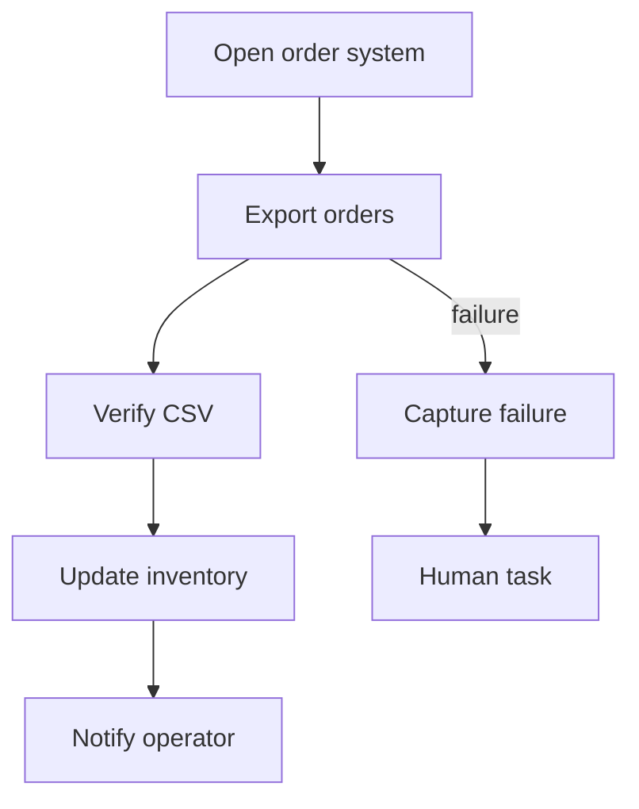
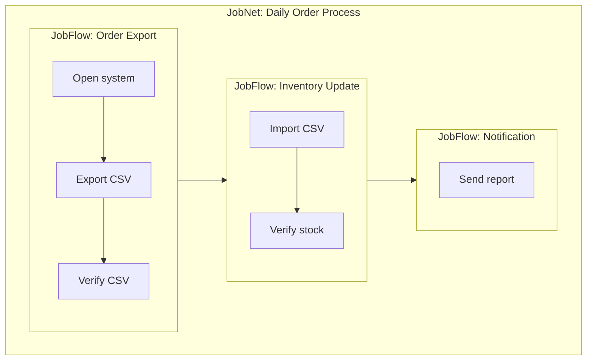

# JobNet and Scheduler Design

## Purpose

actgram should evolve from a macro generator into a business automation scheduler.

The scheduler must support a hierarchical model:

```text
JobNet
  └── JobFlow
        └── Job
              └── ActionDSL / UWSCR
```

This hierarchy allows a single recorded operation to grow into a full business automation platform.

## Concepts

### Job

A Job is the smallest executable unit.

Typical job types:

- UWSCR script execution
- ActionDSL workflow execution
- file check
- command execution
- human approval task
- notification
- verification
- AI-assisted analysis task

### JobFlow

A JobFlow is a directed flow of Jobs.

It expresses dependency, branching, retry, resource locks, and verification.

Examples:

- export order CSV
- import inventory data
- send report mail
- archive files

### JobNet

A JobNet is a collection of JobFlows treated as one managed business operation.

Examples:

- daily order processing
- month-end closing support
- production planning update
- purchase order confirmation

JobNet can contain nested JobNets in the future, but the first implementation should support at least:

```text
JobNet → JobFlow → Job
```

## Data Model

### JobNet Schema

```json
{
  "schema_version": "1.0",
  "jobnet_id": "jn_daily_order_process",
  "name": "Daily Order Process",
  "description": "Runs daily order export, inventory update, and notification.",
  "enabled": true,
  "trigger": {
    "type": "schedule",
    "cron": "0 8 * * 1-5",
    "timezone": "Asia/Tokyo"
  },
  "variables": {
    "business_date": "${today}",
    "output_dir": "C:\\Work\\Orders"
  },
  "resource_locks": ["excel", "order_system"],
  "flows": ["flow_order_export", "flow_inventory_update", "flow_notify"],
  "governance": {
    "requires_approval_to_edit": true,
    "runtime_policy": "production_no_token"
  }
}
```

### JobFlow Schema

```json
{
  "schema_version": "1.0",
  "flow_id": "flow_order_export",
  "name": "Export Order CSV",
  "jobs": [
    {
      "job_id": "job_open_order_system",
      "type": "uwscr",
      "script": "scripts/open_order_system.uws"
    },
    {
      "job_id": "job_export_orders",
      "type": "actiondsl",
      "workflow": "workflows/export_orders.action.json",
      "depends_on": ["job_open_order_system"]
    },
    {
      "job_id": "job_verify_csv",
      "type": "verify_file",
      "path": "${output_dir}\\orders_${business_date}.csv",
      "depends_on": ["job_export_orders"]
    }
  ]
}
```

### Job Schema

```json
{
  "job_id": "job_export_orders",
  "name": "Export orders",
  "type": "actiondsl",
  "workflow": "workflows/export_orders.action.json",
  "depends_on": ["job_open_order_system"],
  "retry": {
    "max_attempts": 2,
    "interval_seconds": 30
  },
  "timeout_seconds": 300,
  "risk": "medium",
  "requires_confirmation": false,
  "resource_locks": ["order_system"],
  "on_success": ["job_verify_csv"],
  "on_failure": ["job_capture_failure", "job_notify_operator"]
}
```

## Trigger Types

Supported trigger types should include:

- manual
- schedule
- file_created
- file_changed
- folder_watch
- mail_received
- webhook
- API
- previous_jobnet_success
- previous_jobnet_failure

MVP should start with:

- manual
- schedule
- file_created

## DAG Execution

JobFlow should be represented as a DAG.

Rules:

- A job runs when all dependencies are successful.
- A failed required dependency blocks downstream jobs.
- Optional dependency failure can be ignored if policy allows.
- Cycles are invalid.
- Jobs with no dependency are entry nodes.

## Resource Lock

Resource locks prevent automation collision.

Examples:

- excel
- browser
- order_system
- erp
- shared_folder
- printer
- outlook

If two jobs require the same exclusive resource, the scheduler must serialize them.

## Human Task

Human tasks are first-class jobs.

Use cases:

- approve high-risk action
- confirm amount before registration
- select exception handling option
- resume after manual work

Human task schema:

```json
{
  "job_id": "job_confirm_order",
  "type": "human_task",
  "message": "Confirm order registration.",
  "fields": ["supplier", "order_no", "amount"],
  "timeout_seconds": 3600,
  "on_approved": ["job_register_order"],
  "on_rejected": ["job_abort"]
}
```

## Mermaid Export

A JobNet or JobFlow must be exportable as Markdown Mermaid with one button.

### Flowchart Example



### JobNet Nested View



## Monitoring

Scheduler should track:

- run status
- start time
- end time
- duration
- success count
- failure count
- retry count
- blocked jobs
- waiting human tasks
- token usage
- cost estimate
- screenshots on failure
- verification result

## Run Report

Recommended path:

```text
runs/jobnet_YYYYMMDD_HHMMSS/run_report.json
```

Required contents:

- jobnet_id
- flow results
- job results
- trigger
- variables
- runtime policy
- approvals
- AI calls
- verification summary
- generated evidence links

## MVP Scope

Initial scheduler MVP:

1. Define JobNet / JobFlow / Job JSON schemas.
2. Load and validate JobFlow DAG.
3. Execute jobs sequentially according to dependencies.
4. Support UWSCR and ActionDSL job types.
5. Export Mermaid Markdown.
6. Produce run report JSON.
7. Add manual trigger from GUI.

Schedule trigger can follow after the basic DAG executor is stable.

## Long-Term Direction

The scheduler should become the upper layer of actgram.

```text
Business Asset
  └── JobNet
        └── JobFlow
              └── Job
                    └── ActionDSL
                          └── UWSCR
```

This lets actgram grow from a recorder into a business automation operating system.
